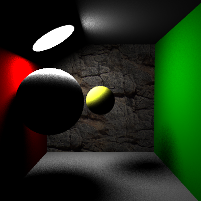
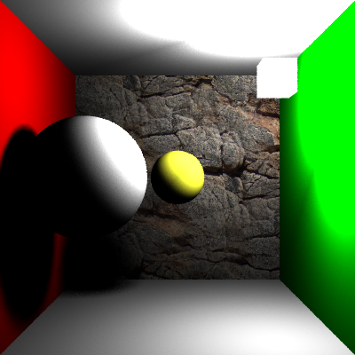
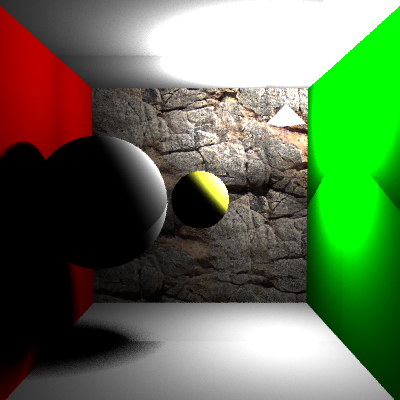
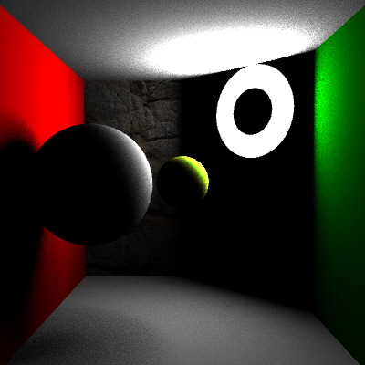
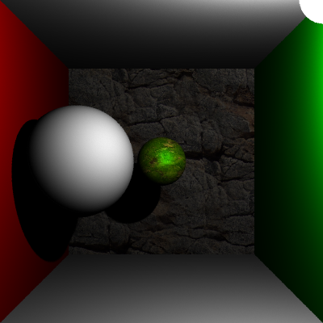

# Graphics_MCPT
CIS 560 project - Monte Carlo Path Tracer 

Basic Monte Carlo path tracer implementation.

## Sample renders
### Different light source types:

|Disc|Cube|
|------|------|
| | |

|Mesh|Ring|
|------|------|
| |  |
 

### new BRDF implementation

|Phong BxDF|
|----------|
||